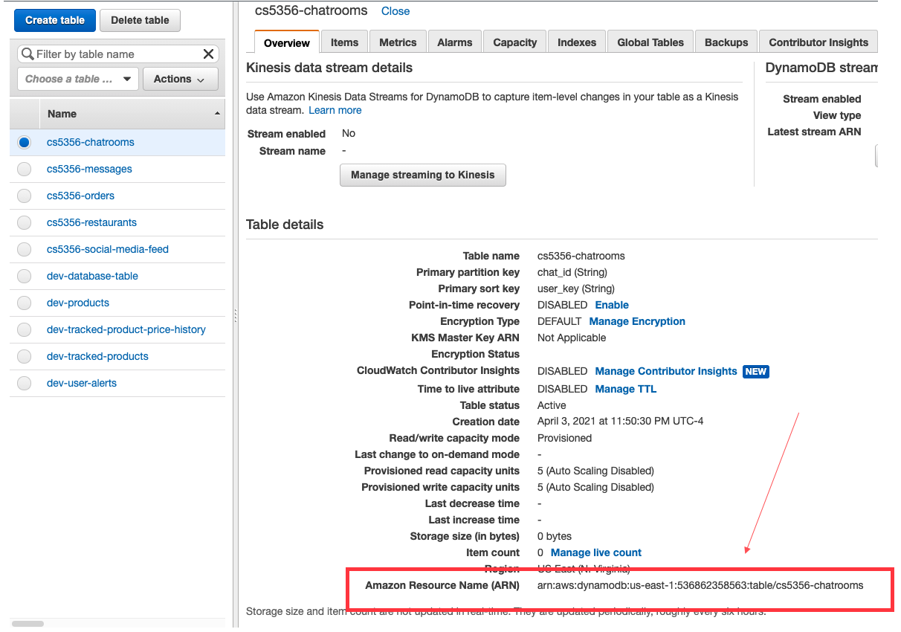

# Assignment #5

Your frontend is talking to your backend over your API and you have things working, at least locally. You know what data you're getting back from your API, and now you know what data you want to send to your API.

## Homework 1/2 - Get it working in prod

In order to get things working in production, you'll have to update your API to return CORS responses. See the walkthrough in [Lesson 5](/lesson-5.md) for a walkthrough on how to implement it in your project.

If you want to learn more about CORS - here's some helpful reading.

- [CORS - MDN docs](https://developer.mozilla.org/en-US/docs/Web/HTTP/CORS)
- [https://www.serverless.com/blog/cors-api-gateway-survival-guide](https://www.serverless.com/blog/cors-api-gateway-survival-guide)

At this point, you should be able to deploy your frontend and your backend to your **production environment** and see the data coming from your backend API.

Submit a screenshot that shows the data on your frontend on your production URL, even if you're just getting it printed on the page.

## Homework 2/2 - Save some data to your backend

**Implement the POST request that you defined in Assignment #4 in your backend.**

- You'll have to validate the users token in the `Authorization: eyJ...` on EVERY request - the checks are fairly fast so you don't need to worry about it being a bottleneck for your code.
- A POST request will include an `event.body` field that contains the data in the request that you want to save
- This will usually be a string of JSON data
- Your code might look like this for a POST /chatroom API to create a chat room

```js
const checkUser = async (event) => {
  const token = event.headers['Authorization']
    if (!token) {
      throw new Error('Missing token')
    }
    const decodedUser = await firebaseTokenVerifier.validate(token, projectId)
    return decodedUser
}

module.exports.hello = async (event) => {
    ...

    if (event.path === '/chatroom' && event.httpMethod === 'POST') {
    // check if the user is authenticated
        let user;
    try {
      user = await checkUser(event)
    } catch (err) {
      return {
        statusCode: 401,
        headers,
        body: JSON.stringify({message: err.message})
      }
    }

    // check that the request contains a body
    if (!event.body) {
      return {
        statusCode: 400,
        headers,
        body: JSON.stringify({message: 'Missing body'})
      }
    }

    // parse the request body as JSON
    const requestBody = JSON.parse(event.body);

    // TODO write that data to your dynamodb table

    // send back a successful response
    return {
        statusCode: 201,
        headers
    }
  }
}
```

**Next, create your DynamoDB Tables and save some data**

- Read this [overview of DynamoDB](https://docs.aws.amazon.com/amazondynamodb/latest/developerguide/Introduction.html) before starting
    - ["What is Amazon DynamoDB? > How It Works"](https://docs.aws.amazon.com/amazondynamodb/latest/developerguide/HowItWorks.html)
    - ["What is Amazon DynamoDB? > From SQL to NoSQL"](https://docs.aws.amazon.com/amazondynamodb/latest/developerguide/SQLtoNoSQL.html) if you're familiar with SQL and want to understand how to apply those concepts to DynamoDB.
    - The `DocumentClient` class from the AWS SDK is the easiest way to read and write data to your table in javascript. [See the docs](https://docs.aws.amazon.com/sdk-for-javascript/v2/developer-guide/dynamodb-example-document-client.html) for how to use it to read/write to your database, and [see the SDK docs for more information](https://docs.aws.amazon.com/AWSJavaScriptSDK/latest/AWS/DynamoDB/DocumentClient.html). The examples in the Cheat Sheet below all use the Document Client interface.
- Refer to the [DynamoDB Data Model Cheat Sheet](https://canvas.cornell.edu/courses/26408/modules/items/933017) for examples of how to create your tables and read/write useful data for the sample applications
- You can copy the snippets from the cheat sheet and fill in the section below `// TODO`
- If you are working on your own project, take a look at the cheat sheet for examples on how to organize and query your data, and write the data thats in the request to your database.
- Update your serverless.yml to include permissions to your DynamoDB tables - you'll add the section labeled `iamRoleStatements` to your file. Replace `<account number>` and `<table name>` with the appropriate names (note - you don't need the angle brackets `<, >`). These rules will apply in your production environment, but not your local environment.

```yaml
provider:
    name: aws
    runtime: nodejs12.x
    stage: dev
    region: us-east-1
    iamRoleStatements: # permissions for all of your functions can be set here
        - Effect: Allow
          Action: # Gives permission to DynamoDB tables in a specific region
              - dynamodb:DescribeTable
              - dynamodb:Query
              - dynamodb:Scan
              - dynamodb:GetItem
              - dynamodb:PutItem
              - dynamodb:UpdateItem
              - dynamodb:DeleteItem
          Resource:
              - 'arn:aws:dynamodb:us-east-1:<account number>:table/<table name>'
```

You can get the Resource ARN from here:



- Save the data to your DynamoDB table using the users identifier from the token `user.sub`. Your code might look like this:

    ```js
    // Create DynamoDB document client
    const AWS = require('aws-sdk')
    const docClient = new AWS.DynamoDB.DocumentClient();

    ...

    if (event.path === '/chatroom' && event.httpMethod === 'POST') {
        ...
        // parse the request body as JSON
        const requestBody = JSON.parse(event.body);

        // write that data to your dynamodb table
      await docClient.put({
            TableName: 'cs5356-chatrooms',
        Item: {
                chatId: requestBody.chatId,
          userKey: user.sub
            }
        })
      return {
          statusCode: 201,
        headers,
      }
    }
    ```

- You can now GET that data right back from your database instead of returning your test data. Modify your GET handler to return the data you just created with either a `docClient.get` or a `docClient.query` (see the cheat sheet!)

    ```js
    if (event.path === '/chatroom' && event.httpMethod === 'GET') {
        ...
        // get the data from your table
        // gets all chatrooms that user is a member of
        const results = await docClient.query({
            TableName: 'cs5356-chatrooms',
            KeyConditionExpression: 'userKey = :userKey',
            ExpressionAttributeValues: {
            ':userKey': user.sub,
            }
        })

        // return that data
        return {
            statusCode: 201,
            headers,
            body: JSON.stringify(results)
        }
    }
    ```

    At this point, you should be able to get and save data from your DynamoDB Table, but you'll need to test it with your frontend.

**Use the new API you defined in your frontend**

- Now that the user signed in, you can use the APIs you've defined on the backend
- See the React guide on [how to use Form elements in React](https://reactjs.org/docs/forms.html)
- [See the Bulma docs](https://bulma.io/documentation/form/input/) for different form elements you can make
- As an example, if you're creating a chatroom, you might have a text box + a submit button:

```jsx
class SignedInComponent extends React.Component {
  state = {
        chatrooms: [],
        newChatroomName: null
    }

    fetchChatrooms() {
        const token = await firebase.auth().currentUser?.getIdToken()
        const results = await fetch('http://localhost:4000/dev/chatrooms', {
            headers: {
                'Authorization': token
            }
        })
        this.setState({ chatrooms: results.Items })
    }

    componentDidMount() {
        this.fetchChatrooms()
    }

    onNewChatroomNameUpdated(event) {
        this.setState({newChatroomName: event.target.value})
    }

    async createNewChatroom() {
        const token = await firebase.auth().currentUser?.getIdToken()

        // Make a POST request to your new API
        const response = await fetch('http://localhost:4000/dev/chatrooms', {
            method: 'POST',
            headers: {
                'Authorization': token
            },

            // Include the data you want to save in the body of the request
            // as a JSON string
            body: JSON.stringify({
                chatId: this.state.newChatroomName
            })
        })

        // After the request is made, get all the users chatrooms again
        // which will now include the newest one
        this.fetchChatrooms()
    }

    render() {
            return (
                <div>
                    <div class="title">My Chatrooms</div>
                    <ul>
                        {/* Show all the users chatrooms if they have any */}
                        {
                            this.state.chatrooms.map(chatroom => {
                                return <li>Chat ID: {chatroom.chatId}</li>
                            })
                        }
                    </ul>
                    <div>
                        <div class="title">Create a Chat Room</div>

                        {/* Use an input field with an onChange handler */}
                        <input type="text" onChange={(event) => this.onNewChatroomNameUpdated(event)}></input>

                        {/* Use a button with an onClick handler to create */}
                        <button onClick={() => this.createNewChatroom()}>Create</button>
                    </div>
                </div>
            )
    }
}
```

If you type something into the box, and hit submit, your app will now make a request to your backend API to create a chatroom, and it will then show you all the chatrooms you have created.

At this stage, if you have everything working on your local environment, you should be able to `git push` your frontend code, and `serverless deploy` your backend code to get your production environment updated.

Submit a screenshot of your frontend showing some newly created data from the backend - if you can get it working in production, submit that. But if you can only get it working in your local environment, you can submit a screenshot of it working locally too.

---

If it works in production - congrats! Give yourself a pat on the back - you've successfully built a modern full-stack web application using serverless technologies - a pattern that is quickly taking over the industry.  This is the fastest way for companies to build apps and services to get their products in front of users ASAP.

Technology companies aren't doing anything different than what you did as part of the class, the only difference between you and them is they have more money to throw at dozens of engineers to build products & features faster than you can.

If you decide to continue with your project past this class - you've got a solid foundation to support up to tens of thousands of users on your web app, for dirt-cheap.

Happy coding.