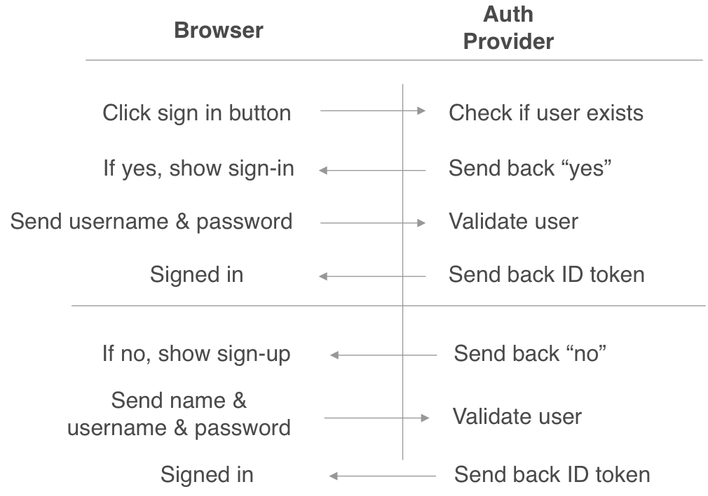

# Lesson 4

## Homework review:

1. We set up Firebase Auth in our React app so we can identify users in our React app
2. We deployed our frontend to AWS using the Amplify Console so that its available to others

### Adding Firebase Auth

Last week, we took a look at a comparison of Authentication providers & what features they offer.

Authentication providers take care of handling all aspects of user login, from storing user emails & passwords, to providing an OAuth & OpenID protocol that we can use to identify users.



**OpenID** is the name of the protocol that provides you with an ID token - a piece of information that proves the user is who they say they are. These are also called JWT tokens - see [jwt.io/introduction](http://jwt.io/introduction) for an overview of the details of the token.

By using Firebase Auth, we were able to ignore the following issues:

- how to store and secure user passwords
- offering a way to reset a password via email
- and offering login with social media providers (if you set it up)

The react-firebaseui npm package gives us an easy way to "drop-in" a sign in component, and listen for changes in authentication state so that we can see who the user is.

By the end of Assignment #3, you should have been able to go through the sign-in flow. We'll take a look at how this works later on.

---

### Deploying your frontend

As part of the assignment, you connected your Github account to the AWS Amplify Console.

The Amplify Console gives you an easy way of deploying a frontend project using HTTPS. Behind the scenes, AWS deploys your project to S3 + Cloudfront - a globally distributed content-delivery network that allows your users all around the world to get to your website with fast load times.

It also comes with a **continuous delivery (CD) pipeline**. A CD pipeline refers to a workflow where you make changes to your application, and you continuously deliver those changes to your production environment when your changes are ready.

This pipeline has the following steps:

- The "provision" step creates a remote environment that will run your "build". Behind the scenes, it creates a nodejs environment in a container and it copies your repository into that container before continuing with the build.
- The "build" step runs a command that you define - in our case, by default, it auto-detects we have a React application, and it runs `npm run build` on AWS servers.
- There is a "test" step (empty by default) that you can use to run unit tests, or other automated tests. I'll talk about this a little more in a later class, but we might not get to dive too deep into it.
- The "deploy" step will take the output of your build, everything in the dist/ folder, and ship those files to S3 + Cloudfront.
- The "verify" step will launch your app inside of Chrome and take screenshots to show you that it is working correctly, and what it looks like when its deployed.

AWS Amplify is connected to your Github repository which means that it can listen for new changes that have been pushed to your repository, and it will build/test/deploy those. From this point forward, any time you run `git push` , those changes will make it to your production environment if it passes all the steps in the pipeline!

You also set up a custom domain + SSL. This means that you can access your website via https, it gets the green lock icon in your browser, and all the communication between your browser and your frontend is encrypted!

AWS offers this via Amazon Certificate Manager - a service that lets you create and manage **FREE** SSL certificates that you can use anywhere in AWS. The only catch is that you can't export your certificate out of AWS.

While that seems like a downside, its really easy and free nowadays to get an SSL certificate using tools like [Lets Encrypt](https://letsencrypt.org/). If a website is trying to charge you $$ for an SSL certificate, you're getting scammed - they're available for free!

A couple of years ago, this step would have taken you a couple of weeks to configure, and you'd potentially have to pay multiple thousands to get a valid SSL certificate. Now you can get it almost for free out of the box.

---

## About backend APIs

Now that we've got our frontend deployed all the way through to your production environment, its time to do something useful with it. I'll be showing you how to connect your frontend to your backend API. But before we do that, we have to talk a little bit about APIs.

API stands for Application Programming Interface, and it is a way of defining how to interact with a service programmatically. Lets take a look at some examples

- Twitter has various APIs that let you create and get tweets - [https://developer.twitter.com/en/docs/twitter-api/v1/tweets/post-and-engage/overview](https://developer.twitter.com/en/docs/twitter-api/v1/tweets/post-and-engage/overview)
- Twilio has various APIs available - some that let you programmatically send text messages, or make and monitor phone calls. [https://www.twilio.com/docs/api](https://www.twilio.com/docs/api)
- Check out this github repo for links to [lots of free & publicly accessible APIs](https://github.com/public-apis/public-apis)
- NYC has an Open Data initiative where the local government can publish data and make it accessible via an API - [https://data.cityofnewyork.us/browse?sortBy=most_accessed&utf8=✓](https://data.cityofnewyork.us/browse?sortBy=most_accessed&utf8=%E2%9C%93)

In these cases, the API is an https URL that you can use to get or create various bits of data. APIs will leverage features of the HTTP spec to send data back and forth in a way that makes sense to programmers. It leverages the following features:

- HTTP requests specify a domain & a path
    - [www.example.com/cars](http://www.example.com/cars) - www.example.com is the domain, and /cars is the path or endpoint
- They specify an HTTP method
    - HTTP methods can be GET, POST, PUT, PATCH, DELETE. These verbs dont mean anything on their own, and it is up to the API to do something useful with the verb.
    - GET usually means to get some data
    - POST usually means to create some data or save it to the API
    - PUT usually means to update some data on your API
    - PATCH also means to update some data on your API
    - DELETE usually means to delete some data from your API
- Some HTTP methods can carry data
    - GET requests are can't have a body
    - POST/PUT/PATCH/DELETE methods can have a body
- HTTP requests can add headers to add additional context to the request

Here's an example of this with `fetch` in javascript

```jsx
fetch('https://www.example.com/cars', {
  method: 'POST',
  headers: {
    'Authorization': '....'
  },
  body: {
    make: 'nissan',
    modal: 'altima',
    year: 2001
  }
})
```

We can use these features of HTTP to make an API that means something.

These are examples of a **RESTful** API - a **RESTful** API is one that follows a set of conventions for interacting with your data.

- If your API lets you see different types of cars, you might have an API that looks like this
    - GET /cars - Return a list of all cars
    - GET /car/:id - Return a description of 1 car specified by ID
    - POST /car - Create a new car object to save in your API
        - the body field should contain the object representing your new car details
    - PUT /car/:id - Update some properties on a car
        - the body field should contain the properties you want to update on a car object
    - DELETE /car/:id - Delete a car from your API by specifying its ID

Lets take a look at PokeApi - an [API to get Pokemon details](https://pokeapi.co/)

- If you're exploring it for the first time, try the Try it now! links
- APIs will generally have documentation that describes what **endpoints** are available and how to use them
    - An **endpoint** is a path that is available in your API. For Assignment #2 - you created a path or an **endpoint** called /whoami which returns your Cornell username
    - Most APIs will send responses back in JSON format which is easy to parse and use from any language `{"username": "da335"}`
- **Endpoints** will return **resources** - a **resource** is a thing that your API provides
    - The /api/v2/pokemon will return a list of Pokemon **resources** - in this case, it returns a list in JSON format, and each item in the list is a Pokemon resource. Each resource contains some data about 1 pokemon like `name` and `abilities`
    - The /api/v2/generation will return a list of Pokemon Game **resources** - in this case, it returns a list in JSON format, and each item in the list is a Game **resource**. Each resource contains a name and a URL for more information.

Having good API documentation makes it easier to use your API, and its easy to create one. It also forces you to consider what data your API needs to provide, and in what structure it needs to be in.

- For **Homework 1/2**, you'll define what paths or **endpoints** are available in your API, and you'll describe what **resources** they return.
    - For example, you just need to include the path or **endpoint** you want to create, and an example of the data it returns:

        ```jsx
        GET /feed

        [
          {
            name: 'da335',
            message: 'arent APIs great?',
            likes: 0,
          }
        ]
        ```

- There are tools like Swagger that can help you write much fancier documentation, but its not necessary for this homework - you can use it if you want, but not required.
- If you're planning a larger project though with multiple team members, having an OpenAPI or Swagger spec is immensely helpful (see this [swagger 101 doc here](https://support.smartbear.com/swaggerhub/docs/tutorials/writing-swagger-definitions.html)). Otherwise, expect to field questions like "how does that API work again?" constantly

## Implement your backend API

Now that you have your spec in psuedo code, it's time to implement it.

- If you're using express or flask, implement your APIs using those tools.
- If you're just using the handler.js, add an additional check for the path & httpMethod

    ```jsx
    module.exports.hello = async (event) => {
      ...
      if (event.path === '/feed' && event.httpMethod === 'GET') {
        return {
          statusCode: 200,
          body: JSON.stringify([{
            name: 'da335',
            message: 'arent APIs great?',
            likes: 0
          }])
        }
      }
    }
    ```

    For this first step, you can return dummy data from your API. In Assignment #5, you'll be getting and saving data from your database, but before we choose a database, we need to know what kind of data we're dealing with. Using test data first is a cheap and easy way to figure out if you have all the data you need in the structure you need it, without worrying about how to use a particular database technology.

    For homework, submit the URL + a path to test and I'll compare it to the spec you wrote in the previous section.

---

## Back to our frontend

We added Firebase Auth, and under the covers it interacts with the Firebase Authentication API. We don't need to know how it works, but its helpful to see an API in action.

When you type in your email and click next, you'll see a new request pop up in your Dev Tools:


- Typing in your email calls this endpoint - `/identitytoolkit/v3/relyingparty/createAuthUri`
- It includes some data in the request body


- And it returns some data about our login


- When we enter the wrong password, we see a failed request to `identitytoolkit/v3/relyingparty/verifyPassword`

    

- And it returns some details about the error

    

- When you type the right password, the request to `verifyPassword` is successful and returns with a 200 status code.
- Theres another request called `getAccountInfo` that returns some info about your account

    

All this data is available to you in the `user` object that is provided to you as part of your Firebase Auth setup in your frontend. You can save the user object to your React component state, and access it later:

```jsx
componentDidMount() {
    firebase.auth().onAuthStateChanged((user) => {
      if (user) {
        this.setState({user});
      } else {
        this.setState({ user: null});
      }
    });
  }
```

[See the firebase.User docs](https://firebase.google.com/docs/reference/js/firebase.User) for more info on what you can get from the user object. This is helpful in your frontend to identify the user.

### Connecting the frontend to the backend

The next step in your app building journey is to connect your frontend to your backend, and request some data thats meant for the user thats using your app.

- If you have a social media feed, you'd want to pull all the messages that are available in the users feed.
- If you have a delivery app, you'd want to pull the users current orders.
- If you have a chat app, you'd want to pull the chat rooms that the user is a part of.

For example, you can call your API using `fetch`

```jsx
// frontend/src/App.js
async componentDidMount() {
	try {
	  const response = await fetch('https://ws00a11wig.execute-api.us-east-1.amazonaws.com/dev/feed')
	  const data = await response.json()
    console.log(data)
	  this.setState({data})
	} catch(err) {
	  console.error(err)
	}
}
```

 But how do you let the backend know who the user is? Should you just include some data to say "da335@cornell.edu" is the one calling the API?

Firebase Auth (& other authentication providers) provide a feature called an ID token (aka JWT token).

The ID tokens provided by Firebase Auth contain information:

- that cryptographically proves that Firebase issued the token
- that provides the users name, email, and a user ID
    - While you CAN use an email address as a user ID, this can break down if they sign in with different social media accounts.
    - You should use the user ID contained in the token in the field named `sub` (short for **subject**)

Since an ID token contains all this data, we can use this to send data to our backend so that our backend can also know the user that is using the API.

A common way of implementing this is to include the ID token in an Authorization header so that the backend can read it.

```jsx
// frontend/src/App.js

const token = await firebase.auth().currentUser.getIdToken()
try {
  const response = await fetch('https://ws00a11wig.execute-api.us-east-1.amazonaws.com/dev/whoami', {headers: { 'Authorization': token}})
  if (response.status === 401) {
    console.log('unauthorized')
  } else {
    const data = await response.json()
    this.setState({data})
  }
} catch(err) {
  console.error(err)
}
```

- The variable `user` has properties and functions that you can call to get some of this data. [See the firebase.User docs](https://firebase.google.com/docs/reference/js/firebase.User) for more info on what you can get from the user object.

### Update your backend to check for an Authorization header

In your backend, add a new package `npm install --save firebase-token-verifier` which will help you cryptographically confirm that firebase issued the token in the header. You can use it like this - (replace the project ID with the one from the Firebase console):

```jsx
const firebaseTokenVerifier = require('firebase-token-verifier')
const projectId = 'my-firebase-project-id'

if (event.path === '/feed' && event.httpMethod === 'GET') {
    const token = event.headers['Authorization']
    if (!token) {
      return {
        statusCode: 401
      }
    }
    try {
      const decoded = await firebaseTokenVerifier.validate(token, projectId)
      // user is now confirmed to be authorized
      return {
        statusCode: 200,
        body: JSON.stringify([{
          name: 'da335',
          message: 'arent APIs great?',
          likes: 0
        }])
      }
    } catch (err) {
      console.error(err)
      return {
        statusCode: 401
      }
    }
  }
```

- You might run into some errors regarding CORS, complaining about missing the Access-Control-Allow-Origin header. If you want to learn more about CORS, check out the [Serverless Survival Guide to CORS](https://www.serverless.com/blog/cors-api-gateway-survival-guide)
    - You'll likely see this if you're using express or flask to build your API since it requires using the Lambda Proxy integration.
        - For express users, use the [cors middleware](https://expressjs.com/en/resources/middleware/cors.html).
        - For flask users, use [flask-cors](https://flask-cors.readthedocs.io/en/latest/)
        - If you're defining your APIs using serverless.yml - add `cors: true`

            ```jsx
            functions:
              feedApi:
                handler: handler.feed
                events:
                  - http:
                    path: /feed
                    method: GET
                    cors: true
            ```

            and make sure to add an `Access-Control-Allow-Origin: *` header to the responses from your API

            ```jsx
            const headers = {
              'Access-Control-Allow-Origin': '*'
            }

            module.exports.hello = async (event) => {
              ...
              if (event.path === '/feed' && event.httpMethod === 'GET') {
                return {
                  statusCode: 200,
                  headers: headers,
                  body: JSON.stringify([{
                    name: 'da335',
                    message: 'arent APIs great?',
                    likes: 0
                  }])
                }
              }
            }
            ```

        - If you're using handler.js AND the Lambda Proxy integration, you'll have to add a couple lines of code to your handler

            ```jsx
            const headers = {
              'Access-Control-Allow-Origin': '*'
            }
            module.exports.hello = async (event) => {
              if (event.httpMethod === 'OPTIONS') {
                return {
                  statusCode: 204,
                  headers
                }
              }
              ...
            }
            ```

        By the end of this, you should have your frontend making a request to your backend, including the ID token in the header.

        See the Assignment for more details on these steps.